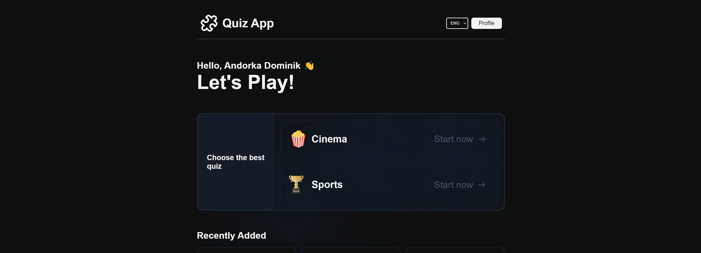

# Quiz App

A dynamic and interactive quiz application built with React. This application allows users to select their preferred language and quiz category, answer questions, and track their performance over time.

<h3 align="center">
    <strong>
      <code>&nbsp;<a href="https://andorkadominik.github.io/Quiz/">Access Here</a>&nbsp;</code>
    </strong>
</h3>

## Features

- **Multi-Language Support**: Users can select from multiple languages (English, Hungarian, German).
- **Category Selection**: Users can choose from a variety of quiz categories.
- **Question Randomization**: Questions are randomly selected from the chosen category.
- **Score Tracking**: Users' scores are tracked and stored in local storage.
- **Profile Management**: Users can update their name and preferred language, view their quiz statistics, and log out.

## Game Overview

The Quiz App provides an engaging and educational experience where users can test their knowledge across various topics. Upon launching the app, users are prompted to enter their name and select their preferred language and quiz category. The game features a series of questions, each with multiple-choice answers. Users must select the correct answer to score points.

### Key Elements of the Game

- **Questions**: Each question is presented with multiple answer options. Only one of these options is correct.
- **Timer**: A timer can be implemented to add an element of urgency and challenge.
- **Immediate Feedback**: After selecting an answer, users receive immediate feedback on whether their choice was correct or incorrect.
- **Score Calculation**: Correct answers earn points, which are tallied up to determine the final score.
- **Results Display**: At the end of the quiz, users are shown their total score and detailed feedback on any incorrect answers.

## Achievements: Quiz Master Title

The Quiz App features a special achievement system to reward dedicated users. One of the most prestigious achievements is the **Quiz Master** title.

### How to Achieve Quiz Master Status

To earn the Quiz Master title, a user must consistently demonstrate exceptional knowledge and performance. The criteria include:

1. **High Score Threshold**: Achieve a score of 90% or higher in at least five different quiz categories.
2. **Consistency**: Maintain an average score of 80% or above across all attempts.
3. **Completion Rate**: Successfully complete a minimum of 20 quizzes.
4. **Languages**: Achieve high scores in quizzes taken in at least two different languages.

### Benefits of Quiz Master Title

- **Recognition**: A special **Quiz Master** icon (crown.svg) is displayed next to the user’s name in their profile.
- **Exclusive Content**: Access to exclusive quiz categories and questions not available to regular users.
- **Leaderboard**: Priority placement on the app’s leaderboard, highlighting top-performing users.

### Tracking Progress

Users can track their progress towards achieving the Quiz Master title in their profile section. The profile displays:

- **Completed Quizzes**: List of quizzes completed with scores.
- **Achievements**: Overview of earned achievements and progress towards new ones.
- **Statistics**: Detailed statistics including average scores, highest scores, and quiz completion rates.

## Components Overview

### `Quiz`

Handles the main quiz functionality including:
- Displaying questions and options.
- Checking answers and updating scores.
- Navigating between questions.
- Displaying results at the end of the quiz.

### `Category`

Handles the display and selection of quiz categories. It also manages the transition to the quiz component once a category is selected.

### `Profile`

Displays user profile information and quiz statistics. Allows users to update their name and language, and provides an option to log out.

## Local Storage Usage

The application makes extensive use of local storage to persist user data, including:
- User name and language preference.
- Quiz scores and statistics.
- Quiz master status.

## Random Question Selection

The function `getRandomQuestions` in `Quiz` component shuffles and selects a subset of questions from the chosen category to ensure each quiz attempt is unique.

## Answer Checking and Score Updating

The `checkAns` function handles answer validation, updates the score, and highlights correct and incorrect answers.

## Result Display

After the user completes the quiz, their score is displayed along with a detailed list of incorrect answers, if any.

## Profile Management

The `Profile` component allows users to view and update their name and language preferences, view their quiz statistics, and log out. It also provides sorting options for viewing quiz statistics based on different criteria. 
